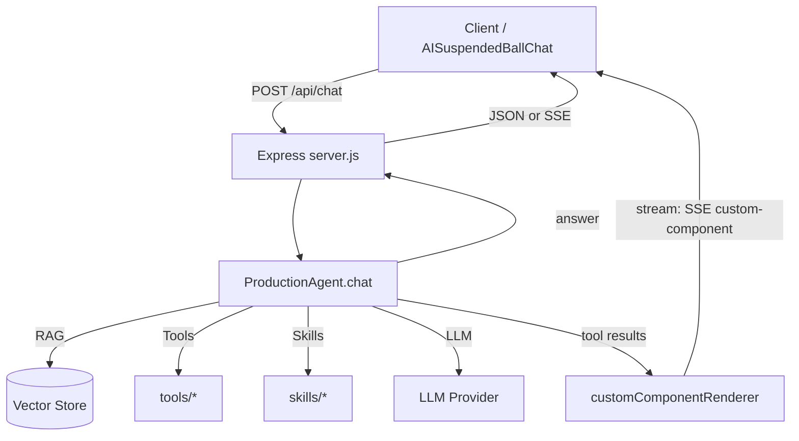

# AI Agent Node 简易脚手架

一个生产级的 AI Agent Node.js 脚手架，提供模块化架构、RAG 知识库检索、工具调用和技能管理等功能。

## 🚀 特性

- 🤖 **智能对话**: 基于 LangChain 的 AI 对话能力
- 📚 **RAG 知识库**: 支持本地知识库检索，可处理 PDF、MD、EPUB 等格式
- 🛠️ **工具系统**: 模块化工具架构，支持代码分析、文档生成、网络搜索等
- 🎯 **技能管理**: 内置多种 AI 技能，支持教学、咨询、问答等场景
- 🌊 **流式响应**: 支持实时流式输出，提升用户体验
- 🔄 **会话管理**: 多会话支持，自动上下文管理
- 🛡️ **容错机制**: 熔断器、重试机制、降级策略
- 📁 **用户文件隔离**: 基于 sessionId 的独立工作空间，自动目录初始化，支持文件数量限制（100个/用户）
- 📧 **邮件发送**: 支持 SMTP 发送，内置多种精美模板（通知/告警/报告/感谢信/验证码/邀请函/营销）
- 🎨 **AISuspendedBallChat 兼容**: 完全符合 AISuspendedBallChat 组件接口规范
 


## 📋 系统要求

- **Node.js**: >= 20.6.0 (推荐使用最新 LTS 版本)
- **Python**: >= 3.7 (用于执行 python_executor 生成的脚本)
- **内存**: 最少 2GB RAM
- **存储**: 至少 1GB 可用空间（用于向量数据库）

### Python 环境要求

`python_executor` 技能和 `exec_code` 工具需要 Python 3 环境。请确保已安装：

```bash
# 检查 Python 版本
python3 --version

# 如未安装，macOS 可通过 Homebrew 安装
brew install python3

# Ubuntu/Debian
sudo apt-get install python3

# CentOS/RHEL
sudo yum install python3
```

## 🛠️ 安装与配置

### 1. 克隆项目

```bash
git clone git@github.com:mingle98/AI-Agent-Node.git
cd AI-Agent-Node
```

### 2. 安装依赖

```bash
npm install
# 或
yarn install
```

### 3. 配置环境变量

复制并编辑 `.env` 文件：

安全提示：
- 请勿将真实的 API Key（例如 DashScope/OpenAI）提交到 Git 仓库
- 建议仅提交 `.env.example`，本地使用 `.env`

```bash
cp .env.example .env

# 如果使用阿里云的模型请前往"阿里云官网"获取你的API_KEY: https://bailian.console.aliyun.com/cn-beijing/?tab=model#/api-key

# 选择 Embedding 提供商: openai 或 aliyun
EMBEDDING_PROVIDER=aliyun

# 选择 LLM 提供商: openai 或 aliyun
LLM_PROVIDER=aliyun

# 阿里云 DashScope API配置
DASHSCOPE_API_KEY=your_dashscope_api_key_here

# OpenAI API配置（如果使用 OpenAI 则取消注释并设置）
# OPENAI_API_KEY=your_openai_api_key_here

# SMTP 邮件发送配置（可选，用于邮件发送功能）
# SMTP_HOST=smtp.qq.com          # QQ邮箱: smtp.qq.com, 163邮箱: smtp.163.com
# SMTP_PORT=465                  # QQ/163邮箱用465，Gmail用587
# SMTP_SECURE=true               # 端口465用true，587用false
# SMTP_USER=your_email@qq.com    # 发件人邮箱
# SMTP_PASS=your_auth_code       # 邮箱授权码（非登录密码！）
# 
# 获取授权码方法：
# - QQ邮箱: 设置 → 账户 → 开启POP3/SMTP服务 → 生成授权码
# - 163邮箱: 设置 → POP3/SMTP/IMAP → 开启服务 → 生成授权码
```

### 4. 启动服务

```bash
npm run dev
```

服务启动后将在 `http://localhost:3000` 提供服务。

## 📡 API 接口

### 对话接口

```http
POST /api/chat
Content-Type: application/json

{
  "query": "你好，请介绍一下 AI Agent",
  "session_id": "user123",
  "isStream": true
}
```

**参数说明：**
- `query`: 用户消息（必填）
- `session_id`: 会话标识（可选，默认 "default"）
- `isStream`: 是否使用流式响应（可选，默认 false）

**流式响应示例：**
```
data: {"code":0,"result":"AI Agent","is_end":false}

data: {"code":0,"result":" 是一种","is_end":false}

data: {"code":0,"result":"能够自主感知环境","is_end":false}

data: {"code":0,"result":"、做出决策并执行行动的智能系统。","is_end":true}

```

### 文件上传接口

```http
POST /api/files/upload
Content-Type: multipart/form-data

表单字段:
- files: 文件（支持多文件，最多10个）
- session_id: 用户会话ID（可选，也可通过 X-Session-Id 请求头传递）
```

**响应示例：**
```json
{
  "success": true,
  "sessionId": "user123",
  "uploadedCount": 2,
  "files": [
    {
      "originalName": "document.pdf",
      "savedName": "1710881234567_document.pdf",
      "size": 1024567,
      "sizeFormatted": "1001.53 KB",
      "path": "uploadFile/1710881234567_document.pdf",
      "url": "http://localhost:3000/workspace/user123/uploadFile/1710881234567_document.pdf"
    }
  ]
}
```

### 存储配额查询接口

```http
GET /api/files/quota?session_id=user123
```

**响应示例：**
```json
{
  "success": true,
  "sessionId": "user123",
  "usedSize": 52428800,
  "usedSizeFormatted": "50 MB",
  "maxSize": 209715200,
  "maxSizeFormatted": "200 MB",
  "remainingSize": 157286400,
  "remainingSizeFormatted": "150 MB",
  "usedPercent": "25.00",
  "fileCount": 25,
  "directoryCount": 5
}
```

### 批量下载/压缩接口

```http
POST /api/files/download
Content-Type: application/json

{
  "session_id": "user123",
  "files": ["uploadFile/doc1.pdf", "uploadFile/doc2.pdf", "projects/data.xlsx"],
  "zipName": "my_files.zip"
}
```

**说明：**
- 最多支持 100 个文件批量下载
- 自动打包为 ZIP 格式
- 只下载存在的文件，不存在的文件自动跳过
- 响应头包含 `Content-Disposition: attachment`，浏览器会自动触发下载

## 🧭 架构与目录结构

### 目录结构（核心）

```text
AI-Agent-Node/
  agent/                 # Agent 核心：会话、上下文、工具/技能调用编排
  tools/                 # 工具：单一能力（如 daily_news、analyze_chart 等）
  skills/                # 技能：组合能力（多步骤流程）
  utils/                 # 通用工具（如 RAG 构建、custom component 渲染）
  knowledge_base/        # 本地知识库源文件（md/pdf/epub/...）
  vector_db/             # 向量数据库（运行时生成/加载）
  public/                # 调试页面（如 aisbc-debug.html）
  server.js              # Express API 入口
```

### 运行时数据流（高层）



## 🎯 与 AISuspendedBallChat 组件集成

### 基础集成

>  AISuspendedBallChat是一个Vue3的前端组件,详细使用文档请查看 [https://www.npmjs.com/package/ai-suspended-ball-chat](https://www.npmjs.com/package/ai-suspended-ball-chat)

```vue
<template>
  <div>
    <SuspendedBallChat 
      app-name="app.test.com" 
      domain-name="juhkff" 
      url="http://localhost:3000/api/chat"
      :custom-request-config="{
        headers: {
          'X-Custom-Header': 'custom-value',
          'Authorization': 'Bearer your-token'
        },
        customParams: {
          model: 'gpt-3.5-turbo',
          temperature: 0.7,
          max_tokens: 1000,
          business_type: 'chat'
        },
        timeout: 30000,
        retry: {
          maxRetries: 3,
          retryDelay: 1000
        },
        requestParamProcessor: (baseParams, customParams) => {
          // 生成会话ID-每个用户唯一的,不能变,通过这个id管理每个用户的上下文记忆
          const sessionId = 'session_123456'
          
          // 添加时间戳
          const timestamp = Date.now()
          
          // 合并基础参数和自定义参数
          const processedParams = {
            ...baseParams,
            ...customParams,
            isStream: true,  // 启用流式响应
            session_id: sessionId,
            timestamp: timestamp,
            request_id: 'req_' + timestamp + '_' + Math.random().toString(36).substr(2, 6),
            // 添加用户信息
            user_info: {
              app_name: 'app.test.com',
              domain_name: 'juhkff',
              user_agent: 'web-browser'
            },
            // 添加业务相关参数
            business_context: {
              source: 'suspended_ball_chat',
              version: '1.0.0',
              platform: 'web'
            }
          }
          console.log('处理后的请求参数:', processedParams)
          return processedParams
        }
      }"
    />
  </div>
</template>

<script setup>
import { SuspendedBallChat } from 'ai-suspended-ball-chat'
</script>
```

## 🔧 功能特性详解

### 已支持的工具

| 工具名称　　　　　　| 功能描述　　　 | 参数　　　　　　　　　　　　　　　　　　 | 示例　　　　　　　　　　　　　　　　　　　　　　　　　　　　　　　　 |
| ---------------------| ----------------| ------------------------------------------| ----------------------------------------------------------------------|
| `search_knowledge`　| 搜索本地知识库 | 查询内容　　　　　　　　　　　　　　　　 | `search_knowledge("AI Agent架构设计")`　　　　　　　　　　　　　　　 |
| `analyze_code`　　　| 代码分析　　　 | 代码内容, 编程语言　　　　　　　　　　　 | `analyze_code("function add(a,b){return a+b}", "javascript")`　　　　|
| `analyze_chart`　　 | 图表分析讲解　 | 图表类型, 图表源码/配置, 分析目标(可选)　| `analyze_chart("mermaid", "graph TD\nA-->B", "解释流程")`　　　　　　|
| `generate_document` | 文档生成　　　 | 文档主题, 文档类型, 大纲　　　　　　　　 | `generate_document("AI Agent快速入门", "tutorial", "1.简介 2.安装")` |
| `daily_news`　　　　| 今日热点　　　 | 平台(可选), 返回条数(可选)　　　　　　　 | `daily_news("tenxunwang", 10)`　　　　　　　　　　　　　　　　　　　 |
| `exec_code`　　　　 | 代码执行　　　 | 代码内容, 编程语言(可选)　　　　　　　　 | `exec_code("console.log(2+3)", "javascript")`　　　　　　　　　　　　|
| `render_mermaid`　　| Mermaid渲染　　| Mermaid源码或图表类型, 图表内容　　　　　| `render_mermaid("sequence", "participant A\nA->>B: msg")`　　　　　　|
| `script_generator`　| Python脚本生成　　　 | 任务描述, 输入数据(可选), 输出格式(可选) | `script_generator("计算平均值", "10,20,30", "auto")`　　　　　　　　 |
| `email_send`　　　　| 邮件发送　　　 | 收件人, 主题, 内容, 选项(可选)　　　　　 | `email_send("user@example.com", "通知", "内容", "{}")` |
| `email_template`　　| 模板邮件发送　 | 收件人, 模板类型, 主题, 变量(可选)　　　 | `email_template("user@example.com", "alert", "告警", "{}")` |
| `email_verify`　　　| 验证SMTP配置 | 无　　　　　　　　　　　　　　　　　　　 | `email_verify()` |
| `schedule_task`　　 | 定时任务调度　| 延迟分钟数, 任务类型, 参数, 描述(可选)　| `schedule_task(2, "email_send", "{\"to\":\"...\"}", "2分钟后发送")` |
| `schedule_list`　　 | 查询定时任务　| 状态过滤(可选)　　　　　　　　　　　　　 | `schedule_list("pending")` |
| `schedule_cancel`　 | 取消定时任务　| 任务ID　　　　　　　　　　　　　　　　　 | `schedule_cancel("task-uuid")` |

### 用户文件管理

系统提供基于 `sessionId` 的用户文件隔离机制，每个用户拥有独立的工作空间：

**核心特性：**
- **用户隔离**: 每个 `sessionId` 对应独立的目录 `/public/workspace/{sessionId}/`，用户间文件完全隔离
- **自动初始化**: 新用户首次访问文件操作时自动创建用户目录
- **数量限制**: 每个用户最多拥有 **100** 个文件
- **存储配额**: 每个用户最多 **200MB** 存储空间
- **安全限制**: 50MB 单文件大小限制，防止路径遍历攻击
- **文件上传**: 支持通过 `/api/files/upload` 接口上传文件到 `uploadFile` 目录
- **批量下载**: 支持打包多个文件为 ZIP 下载

**文件管理工具：**

| 工具名称 | 功能描述 | 示例 |
|---------|---------|------|
| `file_list` | 列出目录文件 | `file_list("docs", true)` |
| `file_read` | 读取文件内容 | `file_read("readme.md")` |
| `file_write` | 创建/写入文件 | `file_write("test.txt", "内容")` |
| `file_delete` | 删除文件/目录 | `file_delete("old.txt")` |
| `file_mkdir` | 创建目录 | `file_mkdir("projects")` |
| `file_move` | 移动/重命名 | `file_move("a.txt", "b.txt")` |
| `file_copy` | 复制文件 | `file_copy("a.txt", "backup/a.txt")` |
| `file_info` | 获取文件信息 | `file_info("data.json")` |
| `file_search` | 搜索文件 | `file_search("report")` |
| `file_quota` | 查询存储配额/剩余空间 | `file_quota()` |
| `excel_read/write` | Excel 操作 | `excel_read("data.xlsx")` |
| `word_read` | Word 读取 | `word_read("doc.docx")` |
| `pdf_read/merge` | PDF 操作 | `pdf_read("doc.pdf")` |
| `csv_read/write` | CSV 操作 | `csv_read("data.csv")` |
| `json_read/write` | JSON 操作 | `json_read("config.json")` |
| `image_info` | 图片信息 | `image_info("photo.jpg")` |
| `svg_write` | SVG 创建 | `svg_write("icon.svg", "<svg>...</svg>")` |
| `zip_compress` | 压缩为 ZIP | `zip_compress("docs", "backup.zip")` |
| `zip_extract` | 解压 ZIP | `zip_extract("data.zip", "output")` |
| `zip_info` | 压缩包信息 | `zip_info("archive.zip")` |
| `zip_list` | 列出 ZIP 内容 | `zip_list("archive.zip", 50)` |

**文件访问 URL：**
文件创建后会返回可访问的 URL，格式为：`http://{host}/workspace/{sessionId}/{filePath}`

### 已支持的技能

| 技能名称　　　　　　　 | 功能描述　　　　　　　　　　 | 参数　　　　　　　 | 示例　　　　　　　　　　　　　　　　　　　　　　　　　　　　　　|
| ------------------------| ------------------------------| --------------------| -----------------------------------------------------------------|
| `ai_agent_teaching`　　| AI Agent 知识教学　　　　　　| 教学主题, 难度级别 | `ai_agent_teaching("ReAct架构", "beginner")`　　　　　　　　　　|
| `component_consulting` | AISuspendedBallChat 组件咨询 | 咨询问题, 组件名称 | `component_consulting("如何配置流式响应", "SuspendedBallChat")` |
| `code_explanation`　　 | 代码解释与教学　　　　　　　 | 代码内容, 详细程度 | `code_explanation("async function fetchData()", "detailed")`　　|
| `mermaid_diagram`　　　| 画流程/时序/类关系/架构图　　 | 图表需求描述, 图表类型 | `mermaid_diagram("帮我把登录逻辑梳理成流程图", "auto")`　　　　|
| `ai_agent_echart`　　　| 数据查询与可视化　　　　　　 | 相关数据需求　　　 | `ai_agent_echart("今年的金价走势怎么样?")`　　　　　　　　　　　|
| `python_executor`　　　| Python脚本生成+执行+分析　　　| 任务描述, 输入数据(可选), 输出格式(可选) | `python_executor("计算漏斗转化率", "exposure=1000,click=100", "auto")` |
| `debug_assistant`　　　| Debug 调试助手　　　　　　　 | 错误信息, 上下文环境 | `debug_assistant("TypeError: Cannot read property...", "React")` |
| `code_review`　　　　　| 代码审查助手　　　　　　　　 | 代码内容, 审查重点 | `code_review("function add(a,b){...}", "all")` |
| `excel_helper`　　　　 | Excel 助手　　　　　　　　　 | 需求描述, 数据类型 | `excel_helper("计算A列平均值", "numbers")` |
| `decision_helper`　　　| 决策助手　　　　　　　　　　 | 决策场景, 可选方案 | `decision_helper("是否换工作", "接受, 拒绝, 再谈条件")` |
| `email_writer`　　　　 | 邮件写作助手　　　　　　　　 | 邮件目的, 背景信息, 语气风格 | `email_writer("跟进", "上周会议方案", "formal")` |
| `email_sender`　　　　 | 邮件发送助手（完整流程）　　 | 收件人, 主题, 内容, 场景类型 | `email_sender("user@example.com", "告警", "CPU使用率过高", "alert")` |


### 配置选项

在 `config.js` 中可以调整以下配置：

```javascript
export const CONFIG = {
  maxHistoryMessages: 20,     // 最大历史消息数
  maxContextLength: 8000,     // 最大上下文 token 数
  ragTopK: 3,                 // RAG 检索返回数量
  streamEnabled: true,        // 是否启用流式输出
};
```

## 🎨 自定义扩展

### 添加新工具

1. 在 `tools/` 目录下创建新工具文件：

```javascript
// tools/myTool.js
export function myCustomTool(param1, param2) {
  // 工具逻辑实现
  return `工具执行结果: ${param1} - ${param2}`;
}
```

2. 在 `tools/index.js` 中注册：

```javascript
import { myCustomTool } from './myTool.js';

export const TOOL_DEFINITIONS = [
  // ... 现有工具
  {
    name: "my_custom_tool",
    func: myCustomTool,
    description: "我的自定义工具",
    params: [
      { name: "参数1", type: "string", example: "示例值1" },
      { name: "参数2", type: "string", example: "示例值2" }
    ],
    example: 'my_custom_tool("值1", "值2")',
  },
];
```

### 添加新技能

1. 在 `skills/` 目录下创建新技能文件：

```javascript
// skills/mySkill.js
export function skillMyCustomSkill(topic, level) {
  // 技能逻辑实现
  return `针对 ${topic} 的 ${level} 级别教学内容...`;
}
```

2. 在 `skills/index.js` 中注册：

```javascript
import { skillMyCustomSkill } from './mySkill.js';

export const SKILL_DEFINITIONS = [
  // ... 现有技能
  {
    name: "my_custom_skill",
    func: skillMyCustomSkill,
    description: "我的自定义技能",
    functionality: "技能功能描述",
    params: [
      { name: "主题", type: "string", example: "AI Agent" },
      { name: "级别", type: "string", example: "beginner", options: ["beginner", "advanced"] }
    ],
    example: 'my_custom_skill("AI Agent", "beginner")',
  },
];
```

### 扩展知识库

1. 将文档文件放入 `knowledge_base/` 目录
2. 支持的格式：
   - `.txt` - 纯文本文件
   - `.md` - Markdown 文件
   - `.pdf` - PDF 文件
   - `.epub` - EPUB 电子书

### 自定义提示词

编辑 `agent/promptBuilder.js` 文件来自定义系统提示词：

```javascript
export function buildSystemPrompt(toolDefinitions, skillDefinitions, options) {
  const { roleName, roleDescription } = options;
  
  return `你是一个${roleName}，${roleDescription}。

你可以使用以下工具：
${toolDefinitions.map(tool => `- ${tool.name}: ${tool.description}`).join('\n')}

你可以使用以下技能：
${skillDefinitions.map(skill => `- ${skill.name}: ${skill.description}`).join('\n')}

请根据用户需求选择合适的工具或技能来回答问题。`;
}
```

## 🔧 高级配置

### Agent 配置选项

在 `server.js` 的 `initAgent` 函数中可以配置：

```javascript
const agent = new ProductionAgent(llm, vectorStore, embeddings, {
  contextStrategy: "trim",           // 上下文策略: trim, summarize, vector, hybrid
  fallbackLlm: fallbackLlm,           // 降级模型
  llmTimeoutMs: 5 * 60 * 1000,               // LLM 超时时间
  toolTimeoutMs: 5 * 60 * 1000,                 // 工具执行超时时间
  llmRetries: 2,                     // LLM 重试次数
  toolRetries: 2,                    // 工具重试次数
  debug: true,                       // 调试模式
  roleName: "自定义助手",             // 角色名称
  roleDescription: "功能描述",        // 角色描述
  maxIterations: 5,                  // 最大迭代次数
  sessionTtlMs: 30 * 60 * 1000,     // 会话过期时间
  maxSessions: 300,                  // 最大会话数
});
```

### 上下文策略

- `trim`: 直接裁剪历史消息
- `summarize`: 总结历史对话
- `vector`: 基于向量相似度选择相关上下文
- `hybrid`: 混合策略

## 📄 许可证

本项目采用 ISC 许可证 - 查看 [LICENSE](LICENSE) 文件了解详情。

## 🙏 致谢

- [LangChain](https://langchain.com/) - AI 应用开发框架
- [AISuspendedBallChat](https://github.com/your-repo/ai-suspended-ball-chat) - 前端聊天组件
- [阿里云 DashScope](https://dashscope.aliyun.com/) - AI 模型服务