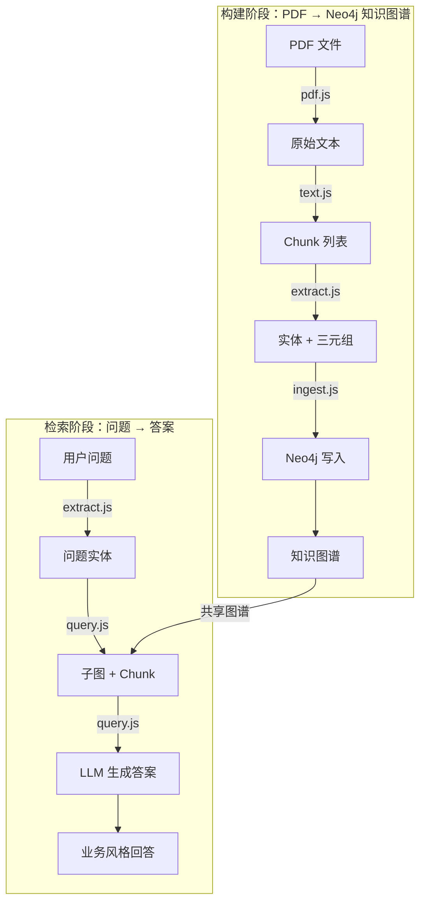

# Neo4j GraphRAG (learning demo)

## What it does

- Ingest a PDF into Neo4j as:

  - `(:Document {id})-[:HAS_CHUNK]->(:Chunk {id, docId, chunkIndex, text})`
  - `(:Entity {name})-[:MENTIONED_IN]->(:Chunk)`
  - `(:Entity)-[:REL {type, count}]->(:Entity)`

- Query with GraphRAG:

  - Extract entities from the question (LLM)
  - Find matching entities in Neo4j
  - Expand a small subgraph (multi-hop) + collect mentioned chunks
  - Use graph triples + chunks as grounding context to answer (LLM)

## Setup

1. Install deps (repo root)

```bash
npm i
```

2. Prepare env

Copy `.env.example` to repo root `.env` (or export env vars in shell):

- `NEO4J_URI`
- `NEO4J_USER`
- `NEO4J_PASSWORD`
- `NEO4J_DATABASE` (optional)
- `OPENAI_API_KEY`
- `OPENAI_MODEL` (optional)

3. Start Neo4j

Make sure Neo4j is running and reachable at `NEO4J_URI`.

## Ingest the provided whitepaper PDF

From repo root:

```bash
node demos/graphRAG/neo4j-graph-rag/run_ingest_whitepaper.js
```

Tips:

- If you want a faster trial, edit `run_ingest_whitepaper.js` to pass `--limitChunks 10`, or run:

```bash
node demos/graphRAG/neo4j-graph-rag/ingest.js --pdf "./knowledge_base/[译] AI Agent（智能体）技术白皮书（Google，2024）.pdf" --limitChunks 10
```

## Query

From repo root:

```bash
node demos/graphRAG/neo4j-graph-rag/run_query.js "这份白皮书里 AI Agent 的核心组件有哪些？"
```

## 📊 完整流程图（从构建到检索）



### 🛠️ 关键函数调用链（带注释）

#### 1️⃣ 构建阶段（ingest）

```js
// 入口：run_ingest_whitepaper.js
ingest({
  pdfPath: "./knowledge_base/[译] AI Agent（智能体）技术白皮书（Google，2024）.pdf",
  chunkSize: 800,
  chunkOverlap: 200,
})
```

**内部流程：**

1. **PDF → 原始文本**
   - `pdf.extractText(pdfPath)` → `string`

2. **文本 → Chunk**
   - `text.chunk(text, chunkSize, chunkOverlap)` → `Array<{text, idx}>`

3. **Chunk → 实体 + 三元组**
   ```js
   // 对每个 chunk 并行调用
   await Promise.all(chunks.map(chunk => 
     extractTriplesFromText(chunk.text) // → {entities, triples}
   ))
   ```

4. **写入 Neo4j**
   ```js
   // 1) 创建 Document 节点
   await upsertDocument(docId, pdfPath)

   // 2) 对每个 chunk：创建 Chunk 节点 + 关联 Document
   await upsertChunkAndMentions({ docId, chunkIndex, text, entities, triples })

   // 3) 对每个三元组：创建/更新 Entity 节点 + REL 关系
   await upsertTriples(triples)
   ```

**图结构：**
```
(:Document)-[:HAS_CHUNK]->(:Chunk)<-[:MENTIONED_IN]-(:Entity)-[:REL {type,count}]->(:Entity)
```

---

#### 2️⃣ 检索阶段（query）

```js
// 入口：run_query.js 或 demos/graphRAG/index.js
answerQuestion("这份白皮书里 AI Agent 的核心组件有哪些？")
```

**内部流程：**

1. **问题 → 实体**
   ```js
   const seedEntities = await extractEntitiesFromQuestion(question)
   ```

2. **实体 → 子图 + Chunk**
   ```js
   const { matchedEntities, triples, chunks } = await fetchSubgraph({
     seedEntities,
     hop: 2,               // 图扩展跳数
     limitChunks: 8,       // 最多召回 chunk 数
     limitTriples: 60,      // 最多三元组数
   })
   ```

   **Cypher 步骤：**
   - 匹配实体（模糊匹配）
   - 多跳扩展子图（正向+反向）
   - 召回关联 Chunk（按命中次数排序）

3. **生成答案**
   ```js
   const answer = await answerBusinessStyle({
     question,
     conversationSummary: "", // 多轮场景可传摘要
     context: { matchedEntities, triples, chunks }
   })
   ```

   **Prompt 组成：**
   - System Prompt：机器人身份、回答风格
   - User Prompt：对话摘要 + 问题 + 三元组 + Chunk 文本

---

### 📝 常用调试点

| 场景 | 关键函数 | 调试手段 |
|------|----------|----------|
| **实体抽取不准** | `extractEntitiesFromQuestion` | 打印 `seedEntities` |
| **图召回不足** | `fetchSubgraph` | 打印 `matchedEntities`、`triples`、`chunks` |
| **答案质量差** | `answerBusinessStyle` | 打印完整 Prompt（system+user） |
| **写入异常** | `upsertChunkAndMentions`、`upsertTriples` | 检查 Neo4j 日志、约束冲突 |

---

### 🧩 可扩展方向

- **Chunk 嵌入**：给 Chunk 加向量，做混合检索（图+向量）
- **实体链接**：用实体消歧/别名映射，提升匹配准确率
- **动态关系类型**：把 `REL {type}` 改成真正的动态关系类型
- **溯源**：给 `REL` 加 `->Chunk` 边，标记每条三元组的文本出处
- **多文档**：给 Document 加元数据（来源、时间、标签），支持跨文档检索

---
